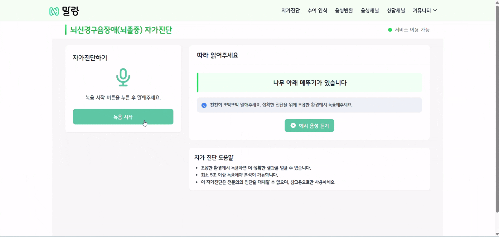
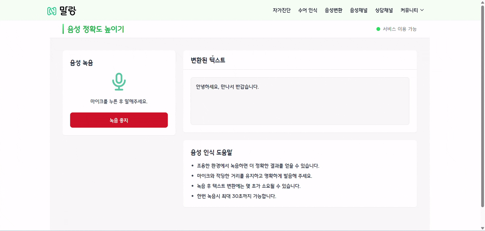
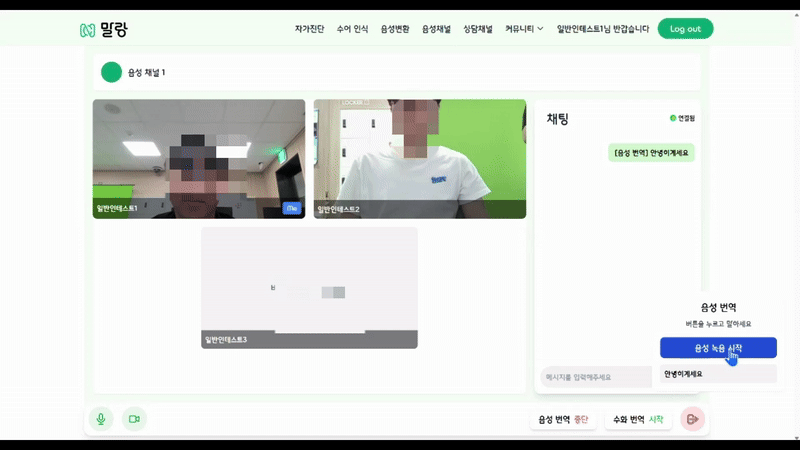
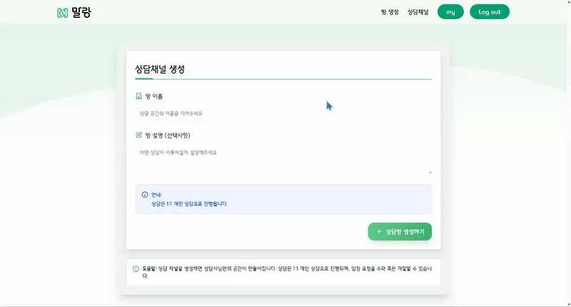
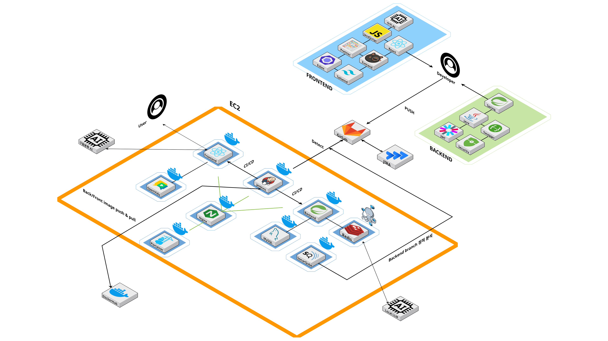
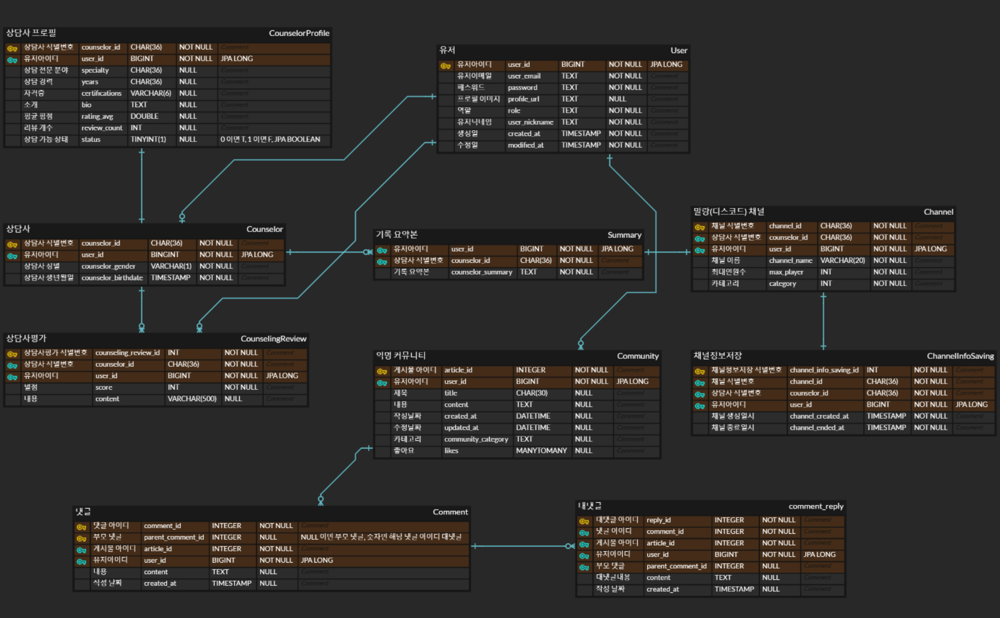
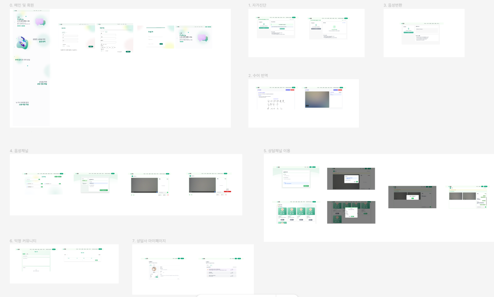

<div align="center">
  
# 말랑

"말랑"은 사회적 약자를 위한 소통 플랫폼입니다. 누군가는 손으로 말하고, 누군가는 말소리가 흐릿하거나 생각을 표현하는데 시간이 더 걸릴 수 있지만, 그 안에 담긴 마음은 정확히 전달되어야 합니다. "말랑"은 이러한 소통의 벽을 허물어 모두가 평등하게 소통할 수 있도록 돕습니다. 기술로 사회적 장벽을 낮추고 모두에게 동등한 혜택을 제공하는 것이 목표였던 프로젝트입니다.

</div>

## 목차

- [개요](#개요)
- [기능 상세 설명](#기능-상세-설명)
- [산출물](#산출물)

## 개요

### 서비스 기능 소개

1. 뇌 질환 및 뇌졸중 조기진단 AI 분류 시스템

2. 수어 인식 및 텍스트 변환 시스템

3. STT 기반 음성 변환 시스템

4. 다대다 채팅 및 화상 회의 시스템

5. 실시간 상담 및 요약 기능 (OpenVidu & WebSocket 적용)

6. JWT & Security를 활용한 안전한 로그인 기능

### 맴버 소개

| 파트      | 담당자                         |
| --------- | ------------------------------ |
| **FE**    | 이성욱, 양다혜, 윤동욱, 정해빈 |
| **BE**    | 권경탁, 송주헌, 태성원         |
| **AI**    | 권경탁, 이성욱, 윤동욱         |
| **Infra** | 권경탁, 송주헌                 |
| **UCC**   | 태성원                         |

### 프로젝트 기간

- 2025년 2월 24일 ~ 2025년 4월 11일

### 기술 스택

Frontend

- React 19.0.10
- JavaScript
- Zustand 5.0.3
- Eslint 8.57.1
- Tailwind 3.3.5
- Prettier 3.5.3
- StompJs 7.1.0
- Openvidu 2.34

Backend

- Java 17.0.14
- Spring 3.4.3
- Websocket (Stomp)
- Openvidu 2.34
- Spring Security
- JWT
- JPA

Infra

- Ubuntu 22.04.5 LTS
- Jenkins 2.492.2
- Docker 28.0.4
- Docker Compose 3.8
- Docker Hub
- Nginx 1.27.4
- Portainer 2.16.2
- SonarQube 6.0.1.5171

DB

- Redis 6.2
- MySQL 8.0

AI

- AI hub brain_classification model (docker image)
- Local LLM (kanana 2.1)
- Mediapipe hands (수어)
- Whisper (STT)

### 프로젝트 구조

```
# Backend

backend
├── auth
    ├── controller/   # 인증 관련 API 컨트롤러
    ├── dto/          # 인증 관련 데이터 전송
    │   ├── request/  # 요청 DTO
    │   └── response/ # 응답 DTO
    ├── event/        # 인증 관련 이벤트
    ├── model/        # 인증 관련 데이터 모델
    ├── repository/   # 인증 관련 데이터 저장소
    └── service/      # 인증 관련 비즈니스 로직
├──channel            # 채널
    ├── controller/
    ├── dto/
    │   ├── request/
    │   └── response/
    ├── model/
    ├── repository/
    └── service/
├──commmon           # global 에러 메시지지
    ├── entity/
    └── exception/
├──config            # 설정
├──localllm          # 로컬 LLM
    ├── client/
    ├── controller/
    ├── dto/
    │   ├── request/
    │   └── response/
    ├── model/
    ├── repository/
    └── service/
├──openvidu          # OpenVidu
    └── controller/
├──s3                # S3
    ├── profile/
    │   └── controller/
    └── summarychatlog/
├──security          # 보안
    └── jwt/
├──speech            # Whisper AI
    ├── controller/
    └── service/
├──websocket         # 웹소켓켓
    ├── controller/
    ├── dto/
    │   ├── request/
    │   └── response/
    └── service/

# Frontend

src
├── api              # API 호출 로직
├── assets           # 디자인 파일 assests
    ├── fonts/
    └── image/
        ├── community/
        ├── homemain1/
        ├── homemain2/
        ├── homemain3/
        ├── login/
        ├── mypage/
        └── signup/
├── components        # 컴포넌트트
    ├── common/
    ├── community/
    ├── hand_language/
    ├── home/
    ├── layout/
    ├── modal/
    ├── selfdiagnosis/
    ├── signup/
    ├── video/
    └── videochannel/
├── contexts          # 컨텍스
├── hooks             # 훅
├── pages             # 페이지지
    ├── community/
    ├── counsel/
    ├── counselchannel/
    ├── home/
    ├── login/
    ├── mypage/
    ├── signup/
    ├── splash/
    └── videochannel/
├── services          # 서비스
├── store             # 상태 저장소
├── styles            # 스타일
└── utils             # 유틸리티

```

## 기능 상세 설명

### 뇌 질환 및 뇌졸중 조기진단 AI 분류 시스템



- 사용자의 목소리의 파형을 분석하는 AI를 활용 하여 사용자가 직접 자가 진단을 할 수 있습니다.

### 수어 인식 및 텍스트 변환 시스템


- Mediapipe hands 모델을 활용 하여 손 동작을 인식하여 텍스트로 변환 합니다.

### STT 기반 음성 변환 시스템



- Whisper 모델을 활용하여 사용자의 목소리를 탐지 후 텍스트로 변환 합니다.

### 실시간 상담 및 요약 기능 & 다대다 채팅 및 화상 회의 시스템



- 여러명의 사용자들이 함께 목소리와 영상 채팅으로 소통을 할 수 있습니다.
- 채팅방의 수어, STT 기능으로 채팅을 대채 할 수 있습니다.



- 상담사 방 입장시 일반 사용자는 실명을 사용하여 검증을 해야합니다.
- 상담사가 정보를 확인 후 사용자를 입장 시킵니다.


- 상담 시작 버튼 누르면 채팅 내역 저장을 시작합니다.
- 상담 종료 버튼을 누르면 저장된 상담 내역을 Local LLM에 보낸 후 요약되어 저장됩니다.
- 상담사는 profile을 통해서 요약된 내용을 확인 할 수 있습니다.

## 산출물

### 아키텍쳐 구상도



### ERD



### API 명세서


### Figma 디자인



### 포팅메뉴얼

- https://mewing-termite-8c0.notion.site/1d1f0a133bc080559507fceff76dda23
